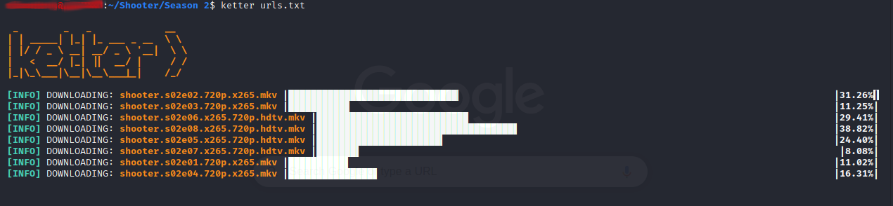

# **Ketter**

* Ketter is an asynchronous HTTP downloader written in Python.

* **See _Ketter Links_ here: https://github.com/kelseykm/ketter_links**

### Depends
* asyncio
* aiohttp
* aiofiles

#### Usage
* Put all the urls of items you want downloaded into a text file and append the path of that "url-file" as an argument when calling ketter.
```
ketter.py <url-file>
```
* **NB:** If the file to be downloaded is already present on the current directory (eg. if it had already been downloaded earlier; fully or partially), ketter will assume it is a partial download and will attempt to resume downloading. If the file was already fully downloaded, the download will fail.
